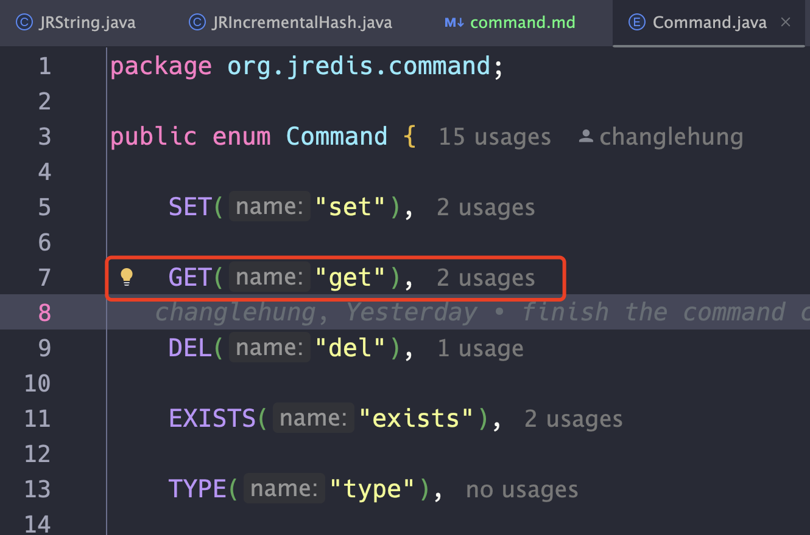

# 如何在 JRedis 当中增加一条新命令

1.   首先在 `enum Command` 类当中新增一个命令类型，如下图所示如果需要增加 `get` 命令就在这个枚举类当中增加一个 GET:

     

2.   继承 `AbstractCommand` 类，并且重写 accept 方法:

     ```java
     public class CommandGet extends AbstractCommand {
       public static final CommandGet GET = new CommandGet(Command.GET);
     
       private CommandGet(Command command) {
         super(command);
       }
     
       @Override
       public JRedisObject accept(RedisDatabase database, JRedisObject... args) throws JRedisDataBaseException {
         if (args.length != 1) {
           throw new JRedisDataBaseException("Wrong number of arguments");
         }
         var ret = database.getDb().get(args[0]);
         if (ret == null) return CommandReturnState.Nil;
         return ret;
       }
     }
     ```

     在实现这个类的时候需要注意保证每一条命令是 `单例` 的，因此他的构造函数应该是 private 的。然后在你的类当中，应当有一个相应的单例子，需要注意的是这个静态字段应该使用 `final` 修饰，因为他需要做到不能够被修改。

3.   在实现方法 `accept` 的时候需要注意，这个函数不因该返回 null 值，这个函数必须返回一个非 null 的 `JRedisObject` 对象，如果你需要返回 null，那么你应该返回 ` CommandReturnState.Nil`，除此之外你可以选择性的返回 ` CommandReturnState.OK`。

4.   最后需要将你实现的 Command 加入到 `CommandContainer` 当中：

     ```java
     
     public class CommandContainer {
     
       private static final Map<Byte, CommandAcceptor> byteCommands = new HashMap<>();
     
       private static final Map<String, CommandAcceptor> nameCommands = new HashMap<>();
     
       public static void initRedisCommands() {
         CommandContainer.addCommand(CommandGet.GET);
         CommandContainer.addCommand(CommandSet.SET);
         CommandContainer.addCommand(CommandExists.EXISTS);
         CommandContainer.addCommand(CommandMget.MGET);
         // 在这里加入你实现的 Command 类
       }
     }
     ```

     

5.   测试，需要将你的测试用例加入到类 `RedisDatabaseTest` 当中，你可以新建一个函数名为 `testCommandXXX`，然后在这里面写入相应的测试用例，比如你要测试 get 和 set 命令：

     ```java
       @Test
       public void testSetAndGet() throws JRedisDataBaseException, IOException {
         JRString name = new JRString("name");
         JRString val = new JRString("val");
         redis.set(name, val);
         assert redis.get(name).equals(val);
         assert redis.exists(name).equals(CommandReturnState.OK);
         logger.pass("get pass");
         logger.pass("set pass");
         logger.pass("exits pass");
       }
     
     ```

     